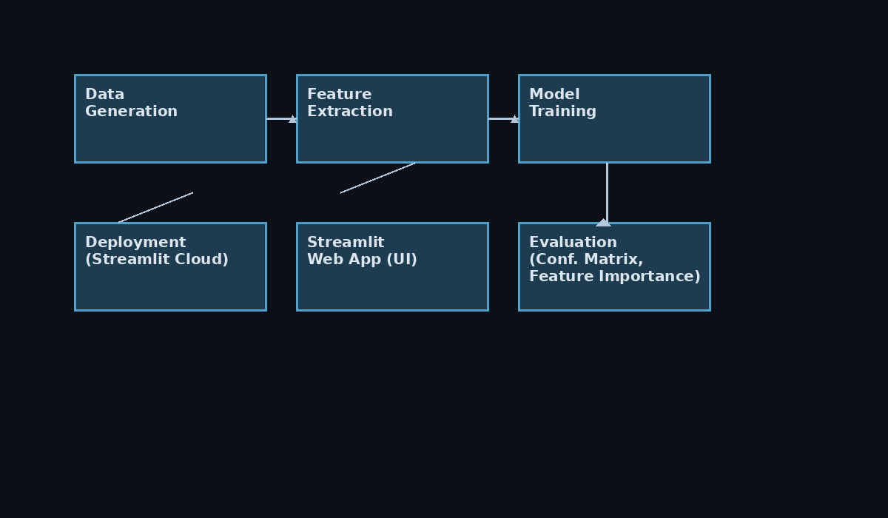
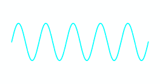

# ⚡ Signal Classification using Machine Learning + DSP + Streamlit

A complete end-to-end ML + DSP project that classifies **Sine, Square, Sawtooth & Noisy signals**,  
applies **Low-Pass Filtering**, shows **FFT Before/After**, and includes a rich interactive  
**Streamlit Web App dashboard** with animations, downloads, uploads & explainability.

Perfect for:
- ECE + CSE Students  
- Hackathons  
- Academic Projects  
- GitHub Portfolio  
- ML + Signal Processing learners  

---

## 🚀 Features

### 🔹 Machine Learning
- Random Forest Classifier  
- Feature extraction (mean, std, skewness, kurtosis, peaks etc)  
- Feature Importance (Explainability)  
- Confusion Matrix (PNG saved)  
- Multi-signal test samples  
- Full accuracy + report  

### 🔹 DSP (Signal Processing)
- Signal generation (sine/square/sawtooth/noisy)  
- Noise simulation  
- **Butterworth Low-Pass Filter**  
- **Before/After FFT spectrum**  
- **Before/After time domain plots**  
- Saves all plots as PNG  
- Saves filtered CSV automatically  

### 🔹 Streamlit Web App
- Live signal generation (sliders)  
- Live ML prediction  
- Time-domain and FFT plots  
- **Low-pass filter visualization (real-time)**  
- **Download PNG waveform button**  
- **Download original + filtered CSV**  
- **Multi-signal comparison grid**  
- **Upload your own CSV & predict**  
- **Oscilloscope-style animation**  
- Clean dark UI  

---

## 📂 Project Structure

signal_classification_project/
│
├── app.py # Complete Streamlit dashboard
├── signal_classification.py # ML training + DSP pipeline + PNG saving
├── feature_utils.py # Feature extraction functions
│
├── data/
│ └── signals_sample.csv # Generated sample dataset
│
├── confusion_matrix.png
├── fft_before.png
├── fft_after.png
├── time_before.png
├── time_after.png
├── feature_importance.png
├── multi_signals.png
├── filtered_signal.csv
│
├── requirements.txt
└── README.md

---

## ▶️ Running the ML Script (Offline)

python signal_classification.py

This generates:
- Confusion matrix  
- FFT before/after  
- Filtered signal  
- Multi-signal previews  
- Feature importance  
- PNG + CSV outputs  

---

## 🌐 Running the Streamlit Web App

python -m streamlit run app.py

Then open:
http://localhost:8501

---

## 📤 Upload Format for User Signals

CSV must have:

time,amplitude
0.00,0.12
0.01,0.18
...

App will:
- Plot your signal  
- Predict type  
- Filter it  
- Let you download filtered CSV  

---

## 🌎 Deployment (Streamlit Cloud)

1. Push your repo to GitHub  
2. Go to https://share.streamlit.io  
3. Click **New App**  
4. Select repo → branch = main → file = `app.py`  
5. Deploy  

Your app gets a public URL instantly.

---

## 🏆 Why This Project Stands Out

- ML + DSP + Web App in **one project**  
- Judge-friendly visualizations  
- Real DSP: FFT + Filtering  
- Explainability (Feature Importance)  
- Upload + Download features  
- Best for hackathons & resume  

---
---

## 📸 Architecture Diagram
Below is the complete architecture flow of the system:

---

## 🎞 Demo GIF (Live Signal Animation)

---

## 📄 Project Report (PDF)
You can download the full project documentation here:

👉 **[Download Report PDF](Signal_Classification_Report.pdf)**

---

## 👤 Author  
**Utkarsh Awasthi**

---

## ⭐ If this project helped you, please ⭐ star the repository!
---

### 🔄 Update (Continuous Improvement)
Added a small enhancement note to keep the project evolving.  
More advanced features and UI improvements will be added step-by-step.  

Stay tuned for upcoming updates!
 ---

### 🔧 Small Update
Improved project documentation formatting and preparing for next enhancement phase.
More updates coming soon.
 Still if and with that I mean there is , need for any updates do let me know about that so that we can work on it. Linkedin id and Github repo is open for all of you. This project can be considered under simulation work as it is required to be connected with hardwares in future.
 
  Thank You guys 
  See you guys next time withy the best projects...